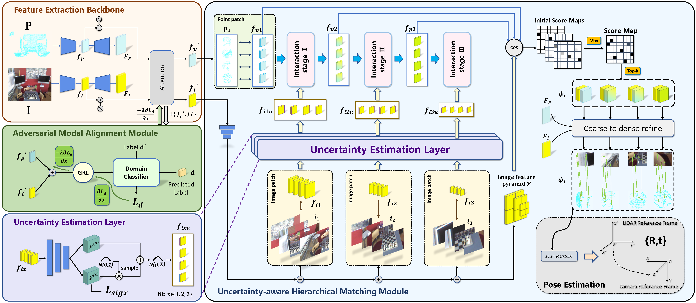

# Bridge-2D-3D-Uncertainty-aware-Hierarchical-Registration-Network-with-Domain-Alignment （AAAI 2025）

We propose the B2-3Dnet, a novel uncertainty-aware hierarchical registration network with domain alignment, demonstrating excellent accuracy and strong generalization in image-to-point cloud registration tasks.

<p align="center">
  
</p>

## Installation

Please use the following command for installation.

```bash
# It is recommended to create a new environment
conda create -n matr2d3d python=3.8
conda activate matr2d3d

# Install vision3d following https://github.com/qinzheng93/vision3d
```

The code has been tested on Python 3.8, PyTorch 1.13.1, Ubuntu 22.04, GCC 11.3 and CUDA 11.7, but it should work with other configurations.

## 7Scenes

### Data preparation

The dataset can be downloaded from [BaiduYun](YOUR_7SCENES_BAIDUYUN_LINK) (extraction code: m7mc). The data should be organized as follows:

```text
--data--7Scenes--metadata
              |--data--chess
                     |--fire
                     |--heads
                     |--office
                     |--pumpkin
                     |--redkitchen
                     |--stairs
```

### Training

The code for 7Scenes is in `experiments/2d3dmatr.7scenes.stage4.level3.stage1`. Use the following command for training.

```bash
CUDA_VISIBLE_DEVICES=0 python trainval.py
```

### Testing

Use the following command for testing.

```bash
CUDA_VISIBLE_DEVICES=0 ./eval.sh EPOCH
```

`EPOCH` is the epoch id.

We also provide pretrained weights in `weights`, use the following command to test the pretrained weights.

```bash
CUDA_VISIBLE_DEVICES=0 python test.py --checkpoint=/path/to/2D3DMATR/weights/2d3dmatr-7scenes.pth
CUDA_VISIBLE_DEVICES=0 python eval.py --test_epoch=-1
```

## RGB-D Scenes V2

### Data preparation

The dataset can be downloaded from [BaiduYun](YOUR_RGBD_SCENES_V2_BAIDUYUN_LINK) (extraction code: 2dc7). The data should be organized as follows:

```text
--data--RGBDScenesV2--metadata
              |--data--rgbd-scenes-v2-scene_01
                     |--...
                     |--rgbd-scenes-v2-scene_14
```

### Training

The code for RGB-D Scenes V2 is in `experiments/2d3dmatr.rgbdv2.stage4.level3.stage1`. Use the following command for training.

```bash
CUDA_VISIBLE_DEVICES=0 python trainval.py
```

### Testing

Use the following command for testing.

```bash
CUDA_VISIBLE_DEVICES=0 ./eval.sh EPOCH
```

`EPOCH` is the epoch id.

We also provide pretrained weights in `weights`, use the following command to test the pretrained weights.

```bash
CUDA_VISIBLE_DEVICES=0 python test.py --checkpoint=/path/to/2D3DMATR/weights/2d3dmatr-rgbdv2.pth
CUDA_VISIBLE_DEVICES=0 python eval.py --test_epoch=-1
```
